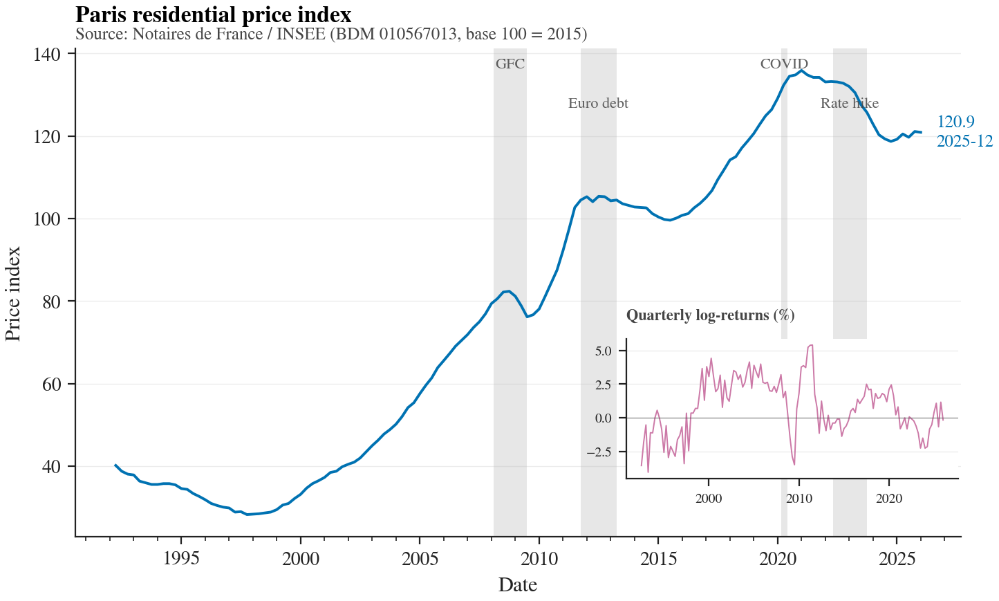

# Selling Property Rental Ownership — A Hybrid Real Estate Model


> A multi-model tranche-pricing study of Paris residential rental cash flows.

**Author** — Dan Allouche · **Working date** — May 2026

This repository implements an end-to-end pricing pipeline for a hybrid
real-estate investment structure in which the rental cash flows of a Paris
residential building are partitioned into senior / mezzanine / equity
tranches, in the spirit of a synthetic CDO. The structure is compared to
two classical benchmarks — outright single-apartment ownership (**Model
A**) and a fully pooled SAS share (**Model B**) — under three canonical
credit-risk models (Gaussian one-factor, Student-t, Cox doubly
stochastic) and a Vasicek short rate.

Every number in the working paper is traceable to the same Monte Carlo
run that writes `artifacts/results.csv` and
`data/processed/calibrated_params.yaml`. No figure or table is imputed.

## Headline figure



Notaires-INSEE Paris flats price index (BDM `010567013`), 1992Q1–2025Q4,
with French / euro-area recession episodes shaded. The inset shows the
quarterly log-returns that drive the GBM calibration.

## Quick start

```bash
git clone https://github.com/dan-allouche-qf/tranche-pricing-paris.git
cd tranche-pricing-paris

# 1. install — editable install with dev extras (pytest, ruff, mypy, ...)
make install                              # equivalent to `pip install -e ".[all]"`

# 2. pull real data, calibrate, run the MC, produce figures and the report
make all                                  # data → calibrate → mc → figures → notebooks → report

# 3. interactive
make dashboard                            # launches Streamlit at http://localhost:8501
```

`make install` is a prerequisite for every other target: the test suite
and CLI both import the project as a top-level package. Without the
editable install, `pytest` raises `ModuleNotFoundError: tranche_pricing`.

Reduced smoke test (no external downloads, small Monte Carlo sample):

```bash
make install && make test
```

## Pipeline

```
data sources              calibration               simulation
-----------------         -----------------         -----------------
Notaires Paris (INSEE) ─► MLE GBM        ─┐
INSEE IRL              ─►                ─┤
OAT 10Y (FRED)         ─► MLE Vasicek    ─┼──►  Monte Carlo  ─►  Waterfall  ─►  Pricing
ECB AAA 10Y            ─►                ─┤    (antithetic + Sobol)        ─►  artifacts/results.csv
Case-Shiller US        ─► (cross-check)  ─┘                                 ─►  report/main.pdf
Fama-French Europe     ─► (cross-check)
Visale / ANIL          ─► default proxy
```

## Layout

```
src/tranche_pricing/        library code
├── data/                   external data acquisition (cache + 7 sources)
├── markets/                GBM, Merton jumps, Vasicek
├── credit/                 Gaussian copula, Student-t copula, Cox intensity, LGD
├── waterfall/              Andersen-Sidenius-Basu (2003) tranche waterfall
├── insurance/              actuarial + option-theoretic
├── simulation/             MC engine, seeds, QMC Sobol
├── calibration/            MLE for every market model + bootstrap
├── pricing/                per-instrument fair price, risk metrics, model compare
├── risk/                   VaR, ES, Sortino, Calmar, Omega
└── viz/                    visual identity, all headline figures

tests/                      150+ pytest unit / property tests
notebooks/                  01 data | 02 calibration | 03 models | 04 tranche | 05 stress
dashboard/                  Streamlit multi-page app (5 pages)
report/                     LaTeX working paper + bibliography + auto-generated tables
config/                     schema-validated scenario YAMLs
artifacts/                  figures + results.csv produced by `make mc`
```

## Headline numbers (from `artifacts/results.csv`, Paris-intermediate scenario)

| Instrument | Initial price (M€) | Fair / par | Mean ann. return | Pr(neg.) |
|---|---:|---:|---:|---:|
| Model A — single apartment | 0.45 | 1.107 | +0.95 % | 22.9 % |
| Model B — SAS pool         | 0.45 | 0.908 | −1.13 % | 70.1 % |
| Equity tranche             | 7.88 | 1.030 | −1.15 % | 52.2 % |
| Mezzanine tranche          | 11.03 | 0.786 | −2.82 % | 98.7 % |
| Senior tranche             | 12.60 | 0.939 | −0.63 % | 100.0 % |

Numbers are the Gaussian one-factor copula baseline without insurance, identical to `report/tables/headline_results.tex`.

Numbers above are read from the latest run of
`tranche-cli mc --config config/paris_intermediate.yaml` and reflect
calibrated GBM (μ = 3.35 %, σ = 4.08 %) and Vasicek (a = 0.016, b = 4.40 %,
σ_r = 0.78 %) on 1992–2026 French data. They will refresh automatically
when you re-run `make mc`.

## Documentation

- **Working paper** — `report/main.pdf` (31 pages, generated by `make report`).
- **Data provenance** — `data/DATA_SOURCES.md`.
- **Calibrated parameters** — `data/processed/calibrated_params.yaml`.
- **Per-instrument results** — `artifacts/results.csv`.
- **Simulation metadata** — `artifacts/results_meta.json`.

## Credits

References, in order of appearance: Li (2000), Vasicek (1977, 1987, 2002),
Merton (1976), Black & Scholes (1973), Hull & White (1990),
Andersen-Sidenius-Basu (2003), Embrechts-McNeil-Straumann (2002),
Donnelly-Embrechts (2010), MacKenzie-Spears (2014), Duffie-Singleton (2003),
Schönbucher (2003), Glasserman (2003), Owen (1997), Acerbi-Tasche (2002).

## License

MIT © 2026 Dan Allouche.
